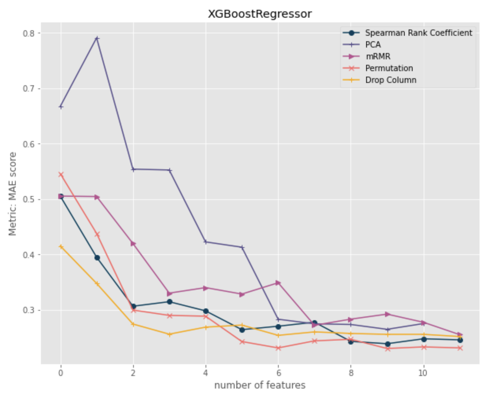

# feature_importance

This report is dedicated to provide a detailed explaination on feature importance, different technics used to measure feature importance and an auto selection function that could pick the best feature selection method for a given ML model.

Strategies applied directly to data:
- Option 1: Spearman's Rank Correlation Coefficient
- Option 2: Principle Component Analysis (PCA)
- Option 3: Minimal-redundancy-maximal-relevance (mRMR)

Strategies applied to models:
- Option 1: Permutation importance
- Option 2: drop column importance

Given above 5 different feature importance strategies, different strategies will rank their feature imporance differently (We used MAE as our metric for model evaluation). I have chosen 3 models for comparison purpose. 1) Regression, 2) Random Forest and 3) XGBoostRegressor. 

<table border="0">
<tr valign="top" border="0">
<td border="0"></a></td>
<td border="0"></a></td>	
<td border="0"></a></td>	
</tr>
</table>

From the comparison above we can see:
- The more features there are, the better the metric presents (specifica to our dataset)
- While some features seems to be more appealing to one of the models, it might not be the case for other models. i.e. Permutation strategy seems to work well with regression model, but it did not perform as well with XGBoostRegressor model
- Depending on how many features we want to select, our choice of strategy might differ as well. i.e. for XGBoostRegressor, if only 4 features are wanted, **drop column** is a better strategy in comparison. However, if we want top 10 features instead, **permutation** will be a better strategy than drop column (due to smaller MAE score)

* Auto Feature Importance Selection Algorithm

