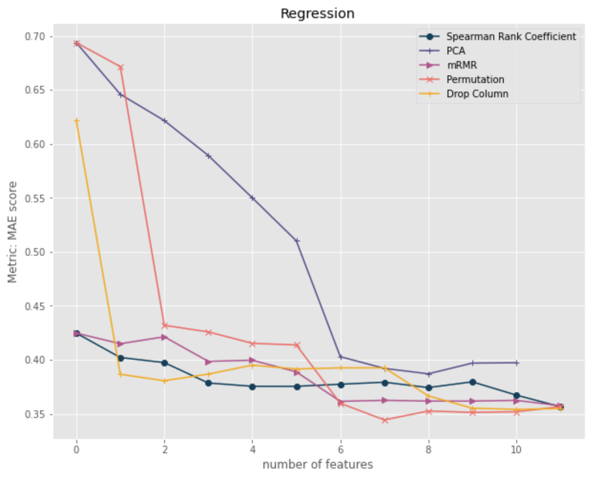
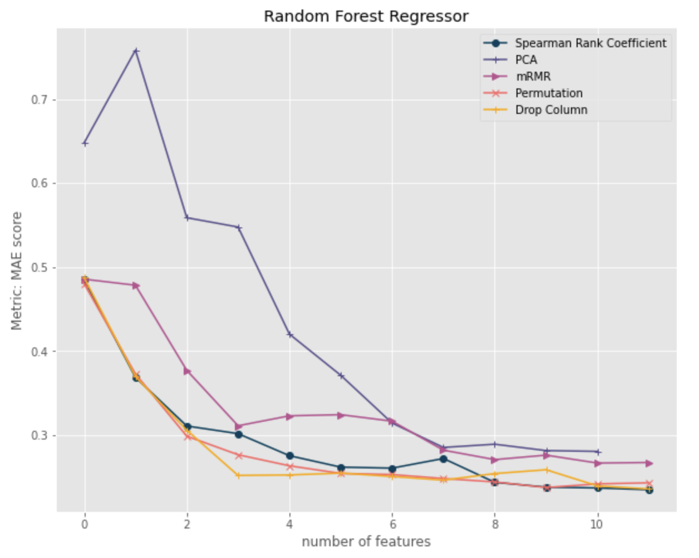

# feature_importance

This report is dedicated to provide a detailed explaination on feature importance, different technics used to measure feature importance and an auto selection function that could pick the best feature selection method for a given ML model.

Strategies applied directly to data:
- Option 1: Spearman's Rank Correlation Coefficient
- Option 2: Principle Component Analysis (PCA)
- Option 3: Minimal-redundancy-maximal-relevance (mRMR)

Strategies applied to models:
- Option 1: Permutation importance
- Option 2: drop column importance

<table border="0">
<tr valign="top" border="0">
<td border="0"></a></td>
<td border="0"></a></td>			
</tr>
</table>
